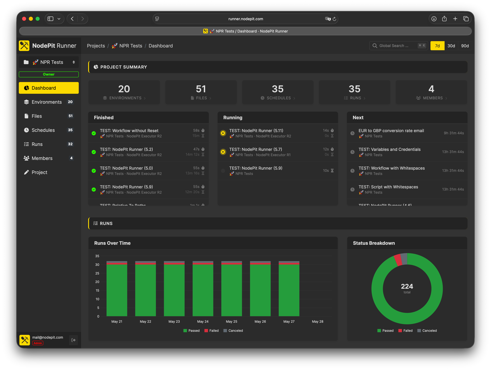

<p align="center">
  <a href="https://github.com/NodePit/runner">
    
  </a>
</p>
<p align="center">
  <b style="font-size: large">NodePit Runner – Workflows Around the Clock!</b>
</p>
<p align="center">
  <a href="https://nodepit.com/product/runner" alt="NodePit Runner: Product">
    
  </a>
  <a href="https://nodepit.com/product/runner/changelog" alt="NodePit Runner: Changelog">
    
  </a>
  <a href="https://nodepit.com/product/runner/license" alt="NodePit Runner: License">
    
  </a>
</p>

[**NodePit Runner**](https://nodepit.com/product/runner) is the perfect complement to the KNIME Analytics Platform and allows you to deploy, execute and monitor your KNIME workflows in the cloud or on-premises as easy as running them locally. Get more information on features, pricing and how to start your free trial period on [**NodePit**](https://nodepit.com/product/runner).

<p align="center">
  
</p>

## ⏱️ Get Started in 60 Seconds

Docker and Docker Compose is the simplest way to run NodePit Runner on a single server or local machine.

1. [Install Docker and Docker Compose](https://docs.docker.com/compose/install/)
1. Download the [`docker-compose.yml`](https://raw.githubusercontent.com/NodePit/runner/main/docker-compose.yml) file (right click the link and “Save as” to an arbitrary location on your computer)
1. Open a terminal and change to the directory where you saved the `docker-compose.yml` file
1. Start NodePit Runner with `docker compose up -d`
1. Open your browser and navigate to `http://localhost:8080` and follow the instructions to create your initial admin account

For configuration options (public URL, secrets, scaling executors, …) and everything else, see [**Installation**](https://docs.nodepit.com/runner/installation) and [**Configuration**](https://docs.nodepit.com/runner/configuration) in the docs.

To upgrade an already running instance, run `docker compose pull` followed by `docker compose up -d`. Database migrations happen automatically.

## 📚 Documentation

The full manual — installation, configuration, guides and the API reference — lives at [**docs.nodepit.com/runner**](https://docs.nodepit.com/runner).

## 🤗 Get Involved

Unsure if NodePit Runner is for you? Drop us a [mail](mailto:mail@nodepit.com) and we answer your questions and even better get you access to our cloud version of NodePit Runner for testing.

* Give a ⭐️ for this repo
* Questions? Just drop us a [mail](mailto:mail@nodepit.com)

## 📖 License

NodePit Runner is licensed under the [NodePit Runner: Terms and Conditions](https://nodepit.com/product/runner/license). By installing and/or using NodePit Runner, you agree and acknowledge the terms and conditions.

## 🤓 Advanced Topics

<details>
  <summary>Show more</summary>

  ## Changing secrets and settings

  `docker-compose.yml` works out of the box with built-in default secrets. To change one — e.g. rotate the MongoDB password or set a public `WEB_BASE_URL` — clone this repo, copy [`.env.example`](.env.example) to `.env`, and edit the values there. Because `.env` is read by every service that needs a given value, you only need to change it in one place.

  ## Vagrant

  If you use [Vagrant](https://developer.hashicorp.com/vagrant), there’s a [Vagrantfile](Vagrantfile) to run a Debian box with Docker preinstalled. Start and connect to the box as follows:

  ```shell
  vagrant up
  vagrant ssh
  ```

  The project directory is mounted to `/vagrant` within the box. From there, you can continue with `docker compose up -d`

</details>

---

Created by [nodepit.com](https://nodepit.com), 2023, 2024, 2025, 2026.
