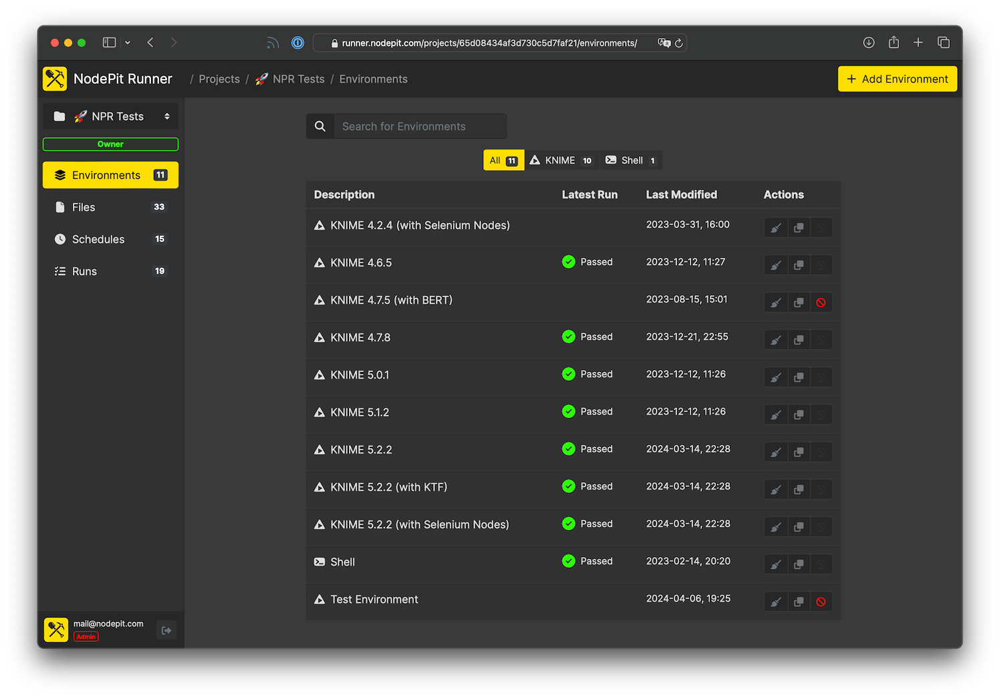

  

  <b style="font-size: large">NodePit Runner – Workflows Around the Clock!</b>

  
  
  
  

[**NodePit Runner**](https://nodepit.com/product/runner) is the perfect complement to the KNIME Analytics Platform and allows you to deploy, execute and monitor your KNIME workflows in the cloud or on-premises as easy as running them locally. Get more information on features, pricing and how to start your free trial period on [**NodePit**](https://nodepit.com/product/runner).

  

## ⏱️ Get Started in 60 Seconds

Docker and Docker Compose is the simplest way to run NodePit Runner on a single server or local machine.

1. Install Docker and Docker Compose
   1. On Linux follow [these](https://docs.docker.com/desktop/install/linux-install/) instructions
   1. On macOS follow [these](https://docs.docker.com/desktop/install/mac-install/) instructions or use Hombrew `brew install --cask docker`
   1. On Windows follow [these](https://docs.docker.com/desktop/install/windows-install/) instructions
1. Download the [`docker-compose.yml`](docker-compose.yml) file.
1. Edit the environment sections of `docker-compose.yml`. See the inline comments for more information
1. Start NodePit Runner with `docker-compose up -d`
1. Open your browser and navigate to `http://localhost:8080`
    1. Follow the instructions to create your initial admin account
    1. Go to the `Settings` menu and configure NodePit Runner according to your preferences

In order to upgrade an already running instance, perform the following steps. No worries, database migrations will happen automatically.

1. Pull latest docker images with `docker-compose pull`
1. Restart NodePit Runner with `docker-compose up -d`

## 🛠 System Requirements

* Recommendation: 2 CPUs, 8 GB Memory (equivalent of `t4g.large` on AWS EC2, or `CX31` on Hetzner Cloud)
* Disk usage varies based on usage and workflow sizes

## 🤗 Get Involved

Unsure if NodePit Runner is for you? Drop us a [mail](mailto:mail@nodepit.com) and we answer your questions and even better get you access to our cloud version of NodePit Runner for testing.

* Follow [@NodePit](https://twitter.com/nodepit/) on Twitter or <a href="https://botsin.space/@nodepit" rel="me">botsin.space/@nodepit</a> on Mastodon
* Give a ⭐️ for this repo
* Questions? Just drop us a [mail](mailto:mail@nodepit.com)

## 📖 License

NodePit Runner is licensed under the [NodePit Runner: Terms and Conditions](https://nodepit.com/product/runner/license). By installing and/or using NodePit Runner, you agree and acknowledge the terms and conditions.

---

Created by [nodepit.com](https://nodepit.com), 2023.
